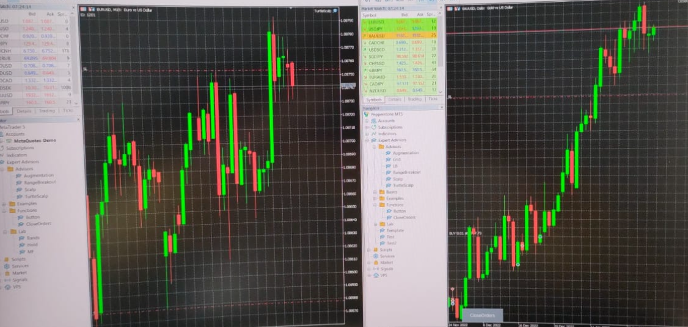

Reasons don't work:
- Based on technica analysis (TA) which probably isn't real (too simplistic)
- Patterns not persistent, not pervasive, etc
- Backtests don't accurately enough represent live conditions (slippage, fees)
- Trading CFDs is just a bad idea (insane leverage, overnight spread, fees, etc)
- Overfitted and not robust despite attempts at (train, val, test split), (small num of params), (small number of combinations of params (small step)), etc during optmisation and testing  
- Past performance is not a predictor of future results or smth like that

Example of Overfitting
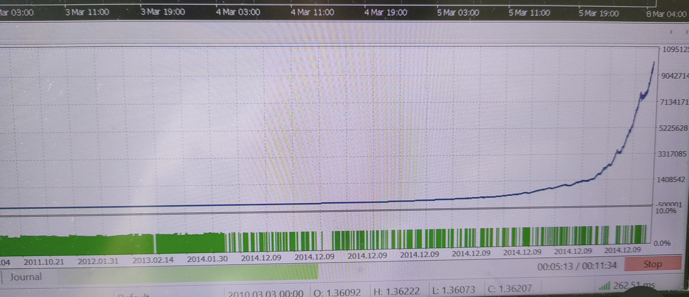

# Example 
Backtest
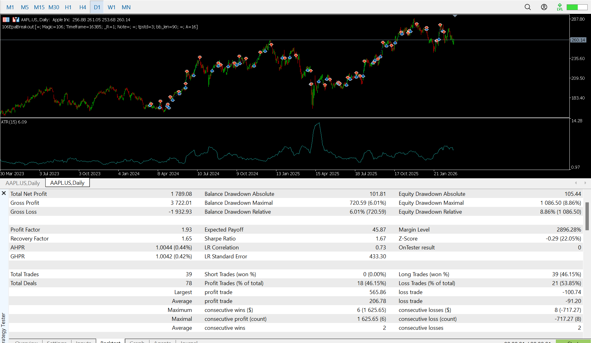
Param Optimisation -> Train + Sensitivity
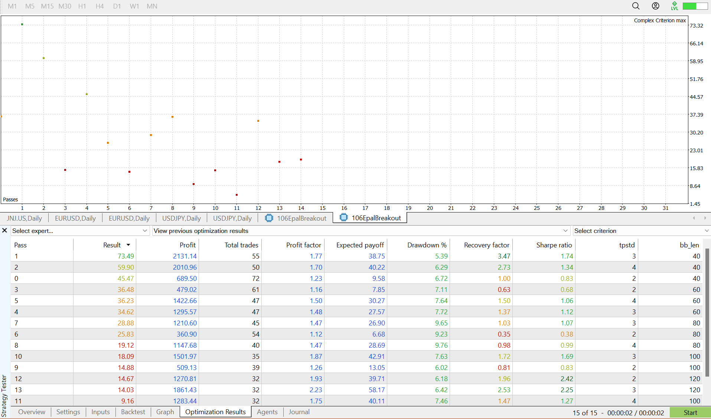
Market Scanner -> Robust + Pervasive
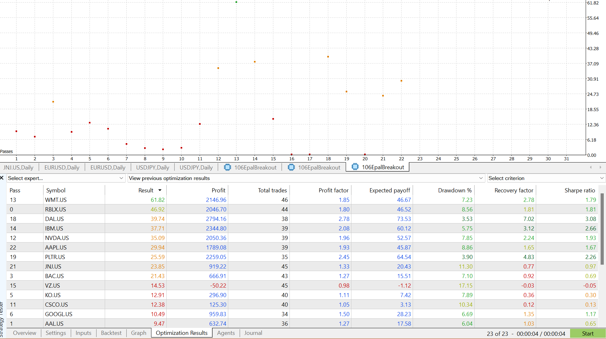

# Forex (Somewhat HFT (not actually))
EURUSD
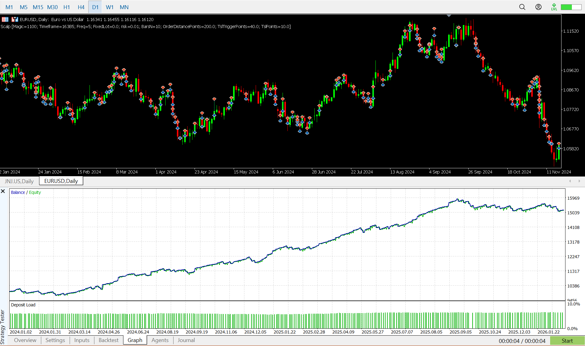  

USDJPY
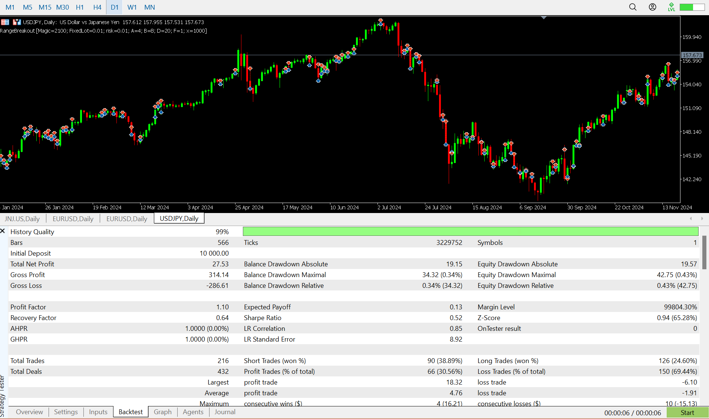   

# Martingale to Intrinsic Value (from DCF, etc)  
RBLX
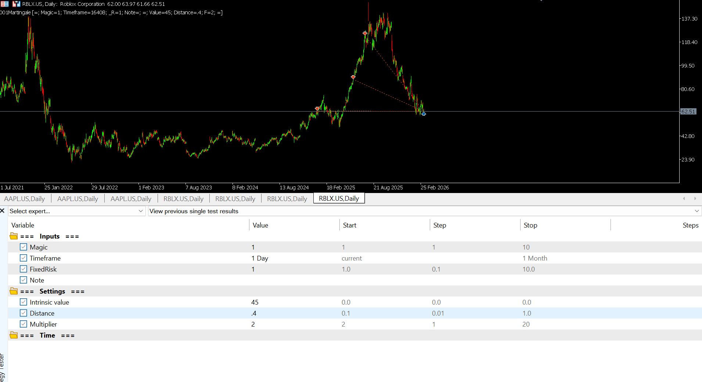  

# Mean Reversion  
AAPL
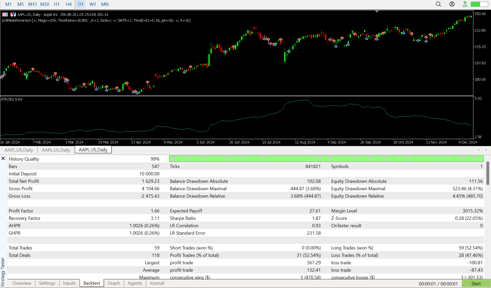

# Breakouts  
USDJPY
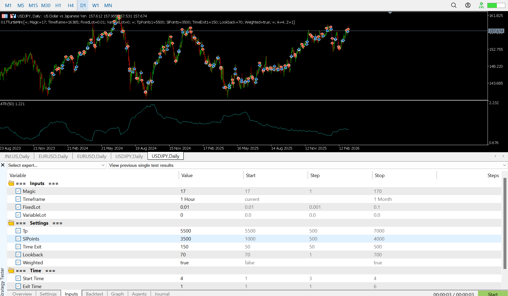  
JNJ
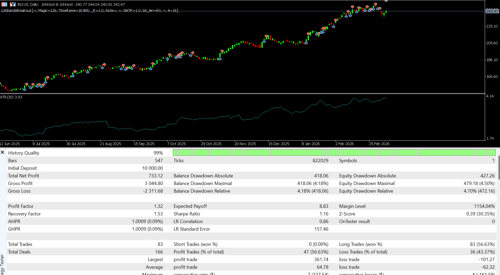

